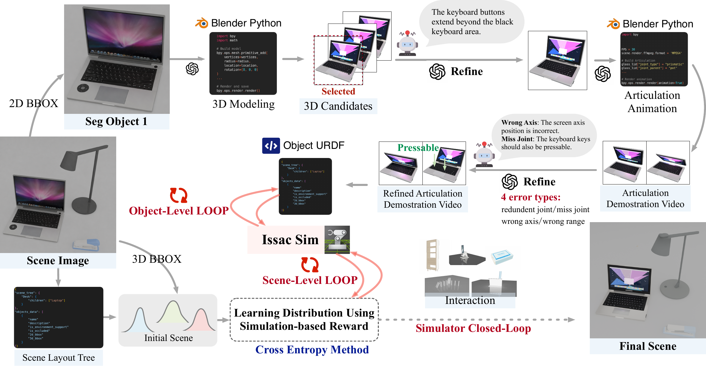
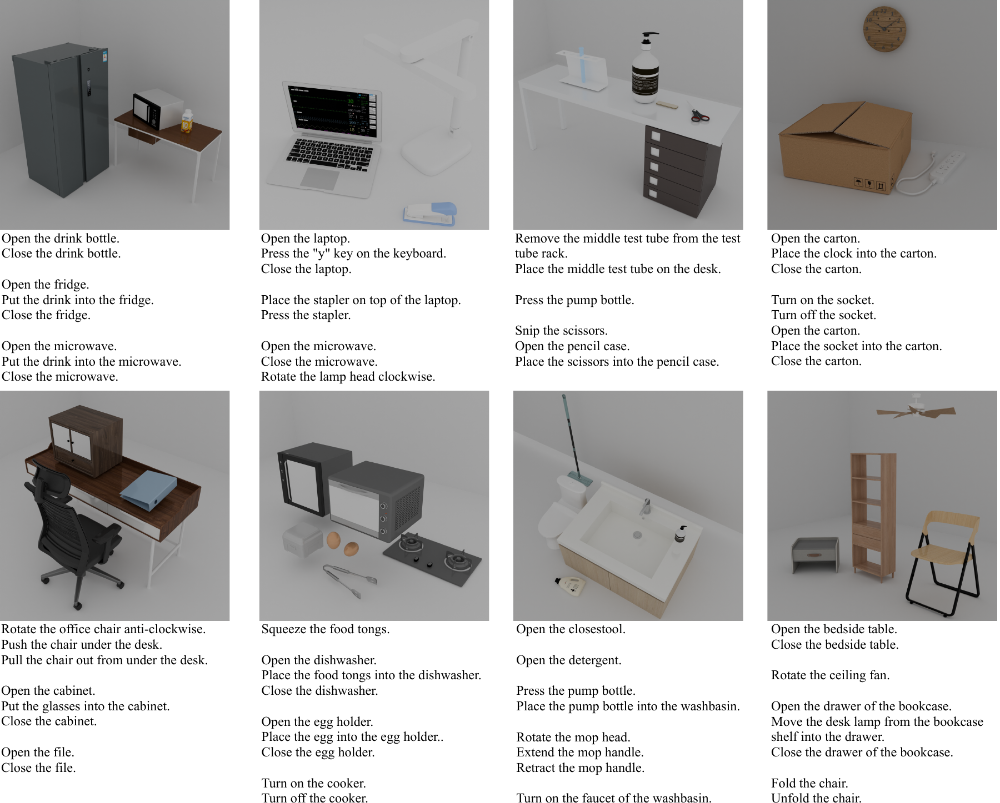
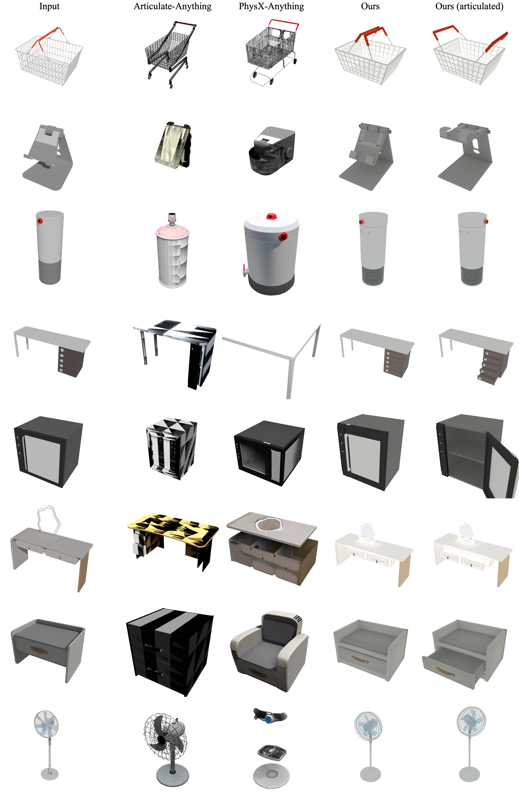
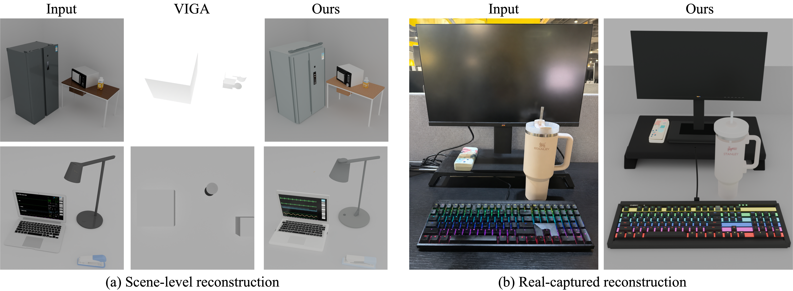

# NeoWorld-Pro
### [Project page](https://raynehe.github.io/PRISM/)

Code for paper: **PRISM: Programming Interactive Scenes from Monocular Images for Embodied Simulation**.

**Paper under review**.

## Abstract

NeoWorld-Pro transforms a single RGB image into executable, simulation-ready interactive scenes with programmable geometry, articulation, physical properties, and scene layout. It reformulates monocular scene reconstruction as a procedural programming task for interactive 3D environments, using multimodal large language models to generate object assets and scene programs.

To improve simulation readiness, NeoWorld-Pro introduces a physics-in-the-loop refinement mechanism. Generated programs are executed in a physics engine, and simulation feedback is used to iteratively correct object geometry, articulation, collision, mass, support relations, and scene consistency. The resulting scenes support stable stacking, fine-grained manipulation, and articulated object interactions for embodied simulation.

## Method Overview

  

NeoWorld-Pro follows a two-level closed loop:

- **Scene parsing:** predict scene hierarchy, object boxes, support relations, and occlusion cues from the input image.
- **Procedural asset programming:** generate editable Blender, URDF, and USD assets for foreground objects.
- **Object-level physics loop:** use free-fall and force-perturbation rollouts to identify mass, collision, joint-axis, joint-range, and articulation errors.
- **Scene-level refinement:** optimize object placement, yaw, and scale in Isaac Sim using simulation rewards and semantic scoring.

## Benchmark and Results

NeoWorld-Pro is evaluated on PartNet-Mobility and a synthetic scene benchmark for physically executable multi-object environments. The benchmark includes **100 object categories**, **80 articulated categories**, **30 USD-format scenes**, and **84 downstream manipulation tasks**. Across these tasks, NeoWorld-Pro achieves a **92.85% task success rate**.

  

### Object-Level Results

  

### Scene-Level Results

  

